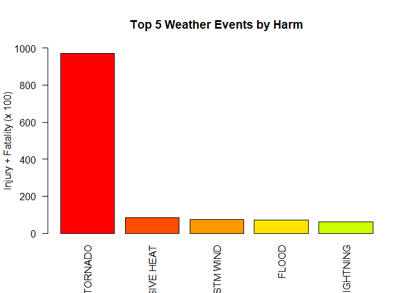
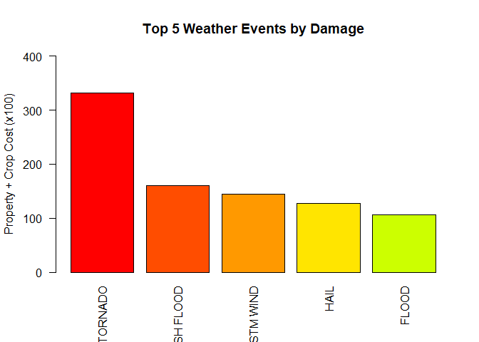

# Understanding the Health and Economic Effects Of Weather in the United States

The goal of this study is to concretely identify what weather event(s) has the biggest the largest impact on our health and our economy in the United States. Data provided by the National Weather Service (NWS) data set will be used in order to derive which weather event impacts the US the hardest. 

## Data Processing

The data provided by NWS is a 47MB download in a compressed CSV format. We will use the native read.csv() function to uncompress and extract the contents into our data data frame.


```r
data <- read.csv("./repdata_data_StormData.csv.bz2", header = TRUE, sep=",")
```

There are 5 primary columns we need to leverage in order to determine what weather events has the most impact on health and the economy. The implementation splits this task into two separate parts - one deriving the health data set while the other derives the economic costs. In both instances, we use the aggregate function to extract the relevant columns while summing a pair of columns into a new column, then renaming the new column name into a more human friendly format. 

Also, for optimization purposes, we enabled cache chunking on this section of code. It is this section of code where we can leverage cached data and avoid consuming too many disk resources.


```r
dataAgg1 <- aggregate(data$PROPDMG+data$CROPDMG, by=list(Event=data$EVTYPE),FUN=sum)
colnames(dataAgg1)[2] <- "TotDamage"

dataAgg2 <- aggregate(data$FATALITIES+data$INJURIES, by=list(Event=data$EVTYPE),FUN=sum)
colnames(dataAgg2)[2] <- "TotHarm"
```

At this point, we have two data frames with that contain 985 rows with two columns. 


```r
dim(dataAgg1)
```

```
## [1] 985   2
```

```r
dim(dataAgg2)
```

```
## [1] 985   2
```

Since we are looking for the top weather event that impacts health and damages, we will re-order the new data frames in descending order and grab the top 5 weather events. 


```r
dataAggOrder1 <- dataAgg1[order(-dataAgg1$TotDamage),]
dataAggOrderSort1 <- head(dataAggOrder1,5)

dataAggOrder2 <- dataAgg2[order(-dataAgg2$TotHarm),]
dataAggOrderSort2 <- head(dataAggOrder2,5)
```
The net result thus far is that we have a 5 x 2 array containing the top 5 events and their related health and economic impact. This can be validated by looking at the dimensions of the newly formed data frame. 


```r
dim(dataAggOrderSort1)
```

```
## [1] 5 2
```

```r
dim(dataAggOrderSort2)
```

```
## [1] 5 2
```

Prior to plotting, an additional data massaging step was taken in order to make the data more readable. To do this, we converted the Total sum columns into a numeric and divided the element by 100. 


```r
dataAggOrderSort1$TotDamage <- as.numeric(dataAggOrderSort1$TotDamage)
dataAggOrderSort1$TotDamage <- dataAggOrderSort1$TotDamage / 100

dataAggOrderSort2$TotHarm <- as.numeric(dataAggOrderSort2$TotHarm)
dataAggOrderSort2$TotHarm <- dataAggOrderSort2$TotHarm / 100
```

## Results

The results of the data transofrmation are two bar plots. Each bar plot represents the top 5 weather events and their associated (quantitative) impacts. 


```r
barplot(dataAggOrderSort2$TotHarm,names.arg=dataAggOrderSort2$Event, ylab="Injury + Fatality (x 100)", las=2, col=rainbow(20), ylim=c(0,1000),main="Top 5 Weather Events by Harm")
```

<!-- -->

Based on the bar plot above, it is clear that the weather event most harmful for the US population are tornadoes. Below are the precise numbers from the data frame itself. 


```r
head(dataAggOrderSort2)
```

```
##              Event TotHarm
## 834        TORNADO  969.79
## 130 EXCESSIVE HEAT   84.28
## 856      TSTM WIND   74.61
## 170          FLOOD   72.59
## 464      LIGHTNING   60.46
```

The next plot shows the top 5 weather events and their associated damage or cost. 


```r
dataAggOrderSort1$TotDamage <- dataAggOrderSort1$TotDamage / 100

barplot(dataAggOrderSort1$TotDamage,names.arg=dataAggOrderSort1$Event, ylab="Property + Crop Cost (x100)", las=2,col=rainbow(20),ylim=c(0,400),main="Top 5 Weather Events by Damage")
```

<!-- -->

The bar plot above shows that tornadoes, again, are the weather events that cause the most monetary damage in the United States. 

## Summary

Based on the NWS data set, tornadoes in the United States have the largest impact on our society. Additional research and funding should be focused tornado research and better preparing those impacted regions to avoid unnecessary casualties. 
